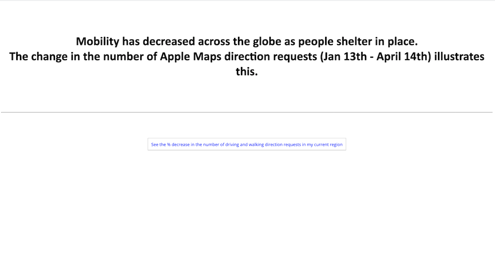
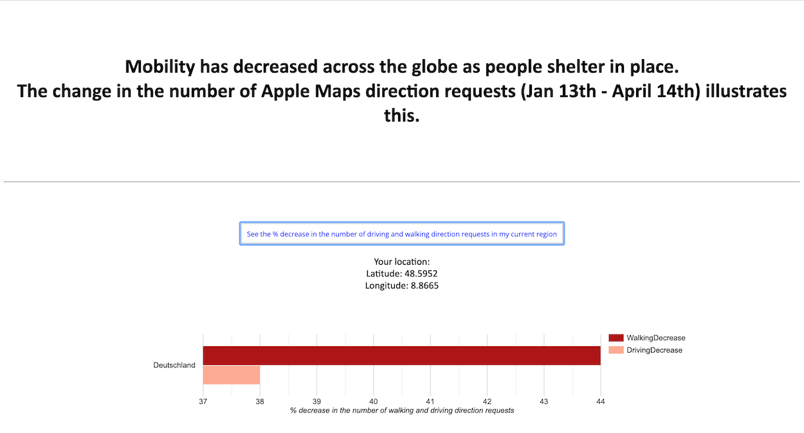

# Sample Project

The DP teaching team has developed a sample project ("MobilityTracker") which you can use as a resource as you are working on your own project. 

 

**Home Page**

 

 

**Dynamic Graph**  

  

You can find the code for the project on Github:
* Final project: https://github.com/demystifying-programming-TA/DP2020/tree/master/DemoProject/Session4_Integration/DPProject

* End-of-session demos for each of the 4 classes: https://github.com/demystifying-programming-TA/DP2020/tree/master/DemoProject
