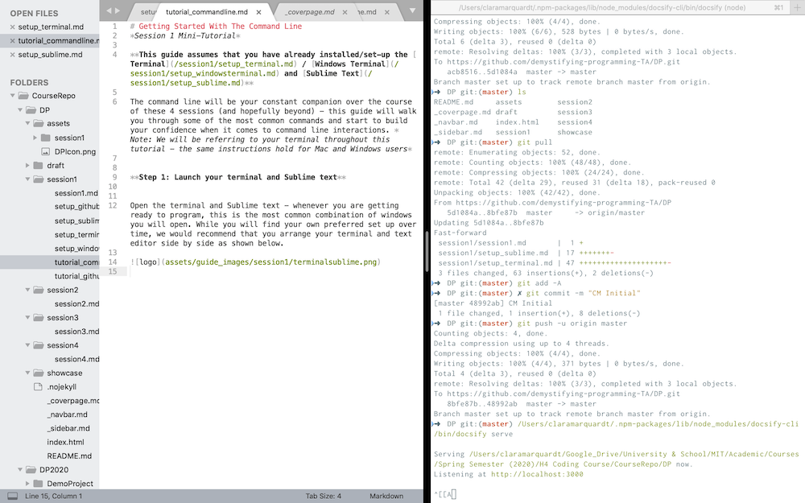

# Getting Started With The Command Line 
*Session 1 Mini-Tutorial*

**This guide assumes that you have already installed/set-up the [Terminal](/session1/setup_terminal.md) / [Windows Terminal](/session1/setup_windowsterminal.md) and [Sublime Text](/session1/setup_sublime.md)**

The command line will be your constant companion over the course of these 4 sessions (and hopefully beyond) - this guide will walk you through some of the most common commands and start to build your confidence when it comes to command line interactions. 

*Note: We will be referring to the Terminal throughout this tutorial - the same instructions hold for Mac and Windows users with a couple exceptions we will note along the way. 

For example: paths on Mac always use a ```/``` (e.g. ```Users/username```), while paths on Windows traditionally use a ```\``` (e.g. ```C:\Users\username```). That being said, ```/``` will work in PowerShell and many other applications.*


**Step 1: Launch the Terminal and Sublime Text (your 'coding environment')**


Open the terminal and Sublime text - whenever you are getting ready to program, this is the most common combination of windows you will open. While you will find your own preferred set up over time, we would recommend that you arrange your terminal and text editor side by side as shown below. 



<hr>

**Step 2: Understanding the lingo: What is the Terminal? What is the Command Line? What is a Shell script?**


* *Terminal:* A graphical user interface (GUI) that allows you to access and interact with the command line

* *Command Line:* An interface that allows you to interact with your operating system 

* *Shell Script:* Shell is a a scripting language that allows you to communicate with your operating system via the Command Line (which in turn you are accessing via the Terminal). Depending on your operating system (e.g., Windows, Linux/Unix) there are different shell languages - for our purposes, we can ignore those differences. A shell script is simply a program (script = program = file that contains a list of commands that are executed sequentially) that is written using Shell (similar to e.g. a Python script or an HTML script)  

<hr>

**Step 3: What's the point of the Command Line?**

Let's walk through some basic commands that you can use to interact with your operating system. 

*Before we do that, how do you even execute a Command Line command?*

Try entering ```whoamI``` then press enter - that's it! You will see that your operating system returned some information on your user identity. Note that not every command will return something, as long as you do not receive an error you can assume that the command was executed. Finally, some commands will return a question (e.g. "remove....?") - unless otherwise specified you can 'respond' to the question with 'y' (yes) or simply hit enter (no).

*Interacting with files, directories, and applications (part #1)*


Rather than providing you with a list of explanations for each command, we want you to figure out the commands simply by using them (this is arguably one of the best approaches to learning how to code - simply enter a command and see what happens!). 


```
pwd

cd ~

pwd

cd ..

pwd

ls

ls -a (mac only)

ls -l (mac only)

ls -la (mac only)

```

If after running the above commands you are still left wondering what a specific command does - try experimenting some more, if that doesn't clarify things, you can access the 'help' page for the command using the ```man``` command (e.g. ```man ls```). If you are wondering how to exit the menu that opens up (a very common challenge) - hit ```q``` (mac) or ```CTRL + C``` (windows) on your keyboard, a good guess for exiting any programming menu/application (other very common way of exiting include for mac: ```exit()```, ```q()```, ```CTRL+C``` and for windows: typing ```exit``` and hitting enter)


*Interacting with files, directories, and applications (part #2)*

```

cd ~

mkdir myDPdirectory

cd myDPdirectory

pwd

ls

touch myfirstfile.txt (mac)
ni myfirstfile.txt (windows)

ls

mv myfirstfile.txt myfirstfile_renamed.txt

ls

cp myfirstfile_renamed.txt myfirstfile_renamed_copy.txt

ls 

open myfirstfile_renamed.txt (mac)
notepad myfirstfile_renamed.txt (windows)


```

*Interacting with files, directories, and applications (part #3)*


At this point, you should be seeing an empty text file. Enter your first 'Hello World!' message into the file, then save and close the file. Let's work with this file now.

```

cd ~

cat ~/myDPdirectory/myfirstfile_renamed.txt
```
Did you get a nice greeting? Let's continue:
```
rm  -i ~/myDPdirectory/myfirstfile_renamed.txt (mac)
rm -confirm ~/myDPdirectory/myfirstfile_renamed.txt (windows)

rm  -i ~/myDPdirectory/myfirstfile_renamed_copy.txt (mac)
rm  -confirm ~/myDPdirectory/myfirstfile_renamed_copy.txt (windows)

ls ~/myDPdirectory

rm -rfi ~/myDPdirectory (mac)
rm -recurse -confirm ~/myDPdirectory (windows)

ls


```


<hr>

**Step 4: What should I do if I can't get a command to run?**


If you get stuck - review the below checklist to rule out common errors:

* It's common (e.g. in online forums such as [Stack Overflow](https://stackoverflow.com/questions)) to use a `$` sign to indicate the start of a command line command - when entering the command into the terminal you will need to ignore the `$` 


* Spaces and capitalization matter (they do in every coding language!!): ```cd myDPdirectory``` is not the same as ```cd mydpdirectory``` (...except capitalization doesn't matter in windows command line); if you are accessing a path that contains a space, e.g. ```~/my folder/``` you will need to 'escape' the space (i.e. ```~/my\ folder/```)

* Some commands require you authenticate yourself with your administrator password (e.g. you won't be able to delete any system-related files unless you authenticate yourself). 

If you get an error message to that effect: 

Firstly - pause and ask yourself if what you are doing is what you actually meant to do

Secondly - assuming you are still OK with the command: 

On *Mac/Linux* you can use the ```sudo```  command ahead of your command (e.g. ``` sudo ls```). When entering ```sudo``` mode, you will be asked to enter your administrator password - note that it won't look like you are typing anything, continue entering your password and press enter once you are done. 

On *Windows* (though not entirely the same) you can run close PowerShell and reopen it "as an administrator" by right clicking the app which will elevate your hacking powers.


