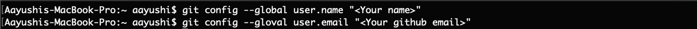
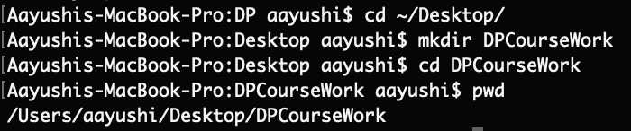
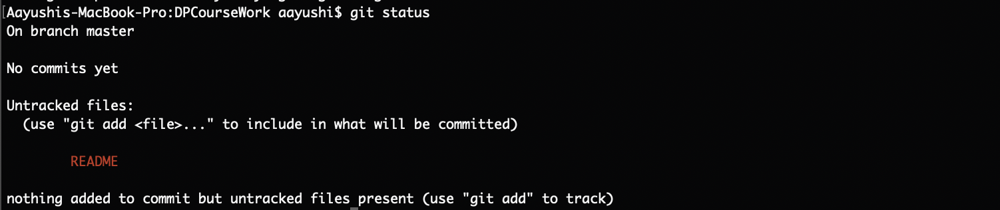
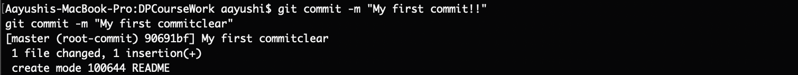
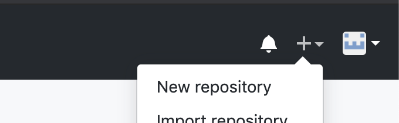
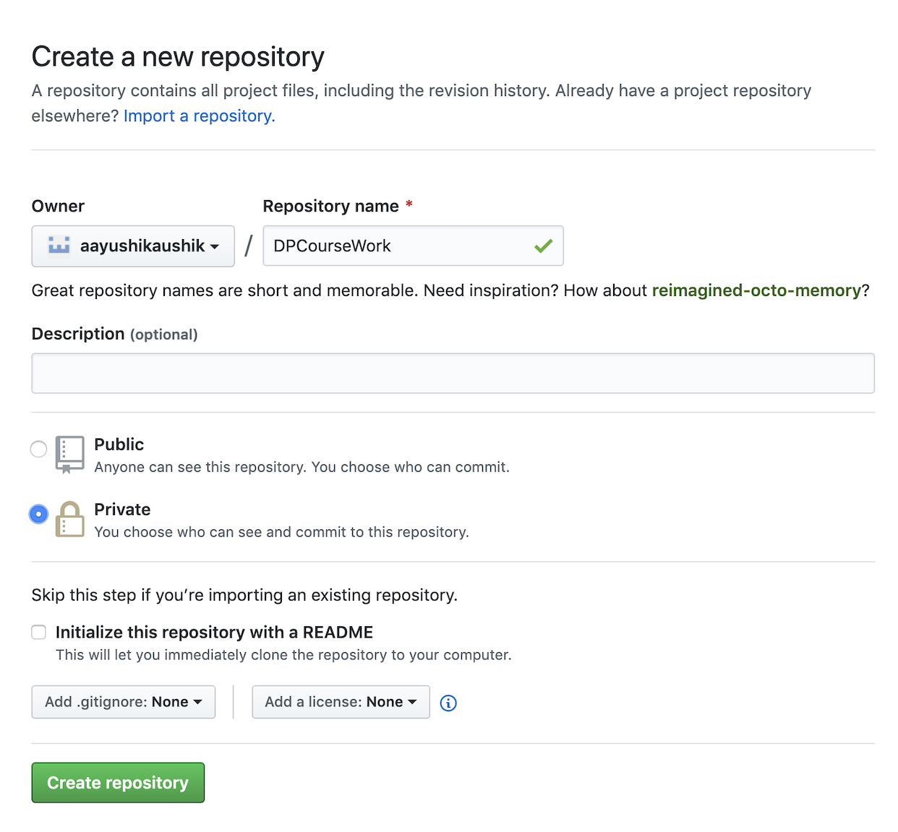
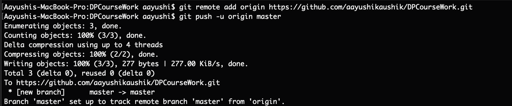

# Getting Started With The Github Command Line Tool
*Session 1 Mini-Tutorial*

Let's walk through some basic commands in git. Note that this tutorial assumes that you already have git installed from the terminal tutorial. 

**Step 0: Set up your Identity**

The work that you will save in the form of commits needs to have your name on it! To provide this information, we modify the `git config` file.

**Step 1: Create the directory that will contain your git repo**

Mac users should launch terminal and Windows users should launch powershell to navigate to the directory where they will be saving work from this class. You can use the `cd` command to navigate to the directory. If you're okay with creating a directory on your desktop, simply type the following:

The `pwd` command confirms that you've switched into the directory you just created.

**Step 2: Initialize git within this directory**

Use the command `git init` as such:

Try listing out the files in the current directory to see what was created!

**Step 3: Make some changes**

Let's create a simple README file that we will push to our repo. You can use the `cat` command to create the file:

Use Ctrl + D to get the terminal prompt back after you finish typing the contents of the README file.

**Step 4: Stage changes**
If you type `git status`, you will notice that there are *untracked changes* in your directory. These are changes that are present in your version of the directory, but have not been 'saved' to your repository within git. 

You can use `git status` to figure out what the state of your repo is at any given time.

We now 'stage' the README file, which is just a fancy way of indicating to git that we would like to add README to a commit that we are about to create.

Try typing git status to see the change that `git add` made.

**Step 5: Commit changes**

Time to commit your change! Use the `git commit` command as such:

**Step 6: Set up your repo on github**

Navigate to [github](www.github.com) and login in to your account. Click on the + button on the top right and then click on New repository.

Fill in the name of your repo, and then click on Create repository at the bottom.

**Step 7: Push your repo from command line**

Since we have an existing repo, we will follow the *second* block of instructions to push our existing repo from command line.

That was your first commit! Welcome to the world of programming!
