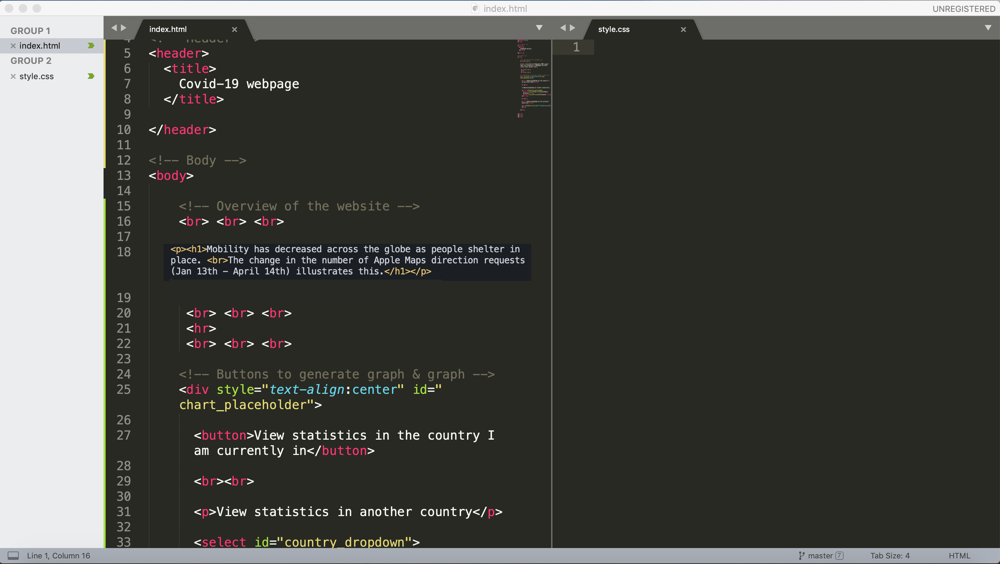

# Static Frontend Development - Part II 

#### CSS

*Session 2 Mini-Tutorial*

**This guide assumes that you have already installed/set-up the [Terminal](/session1/setup_terminal.md) or [Windows PowerShell](/session1/setup_windows_powershell.md) and [Sublime Text](/session1/setup_sublime.md). It also assumes you've completed the [HTML](/session2/tutorial_html_webserver.md) portion skeleton from the previous exercise**


**Step 0: Open your ```style.css``` file**

Open your  ```style.css``` folder by going into Sublime --> File --> Open. Go to your Frontend Folder and open your style.css file. Make sure your  ```index.html``` file is also open. Go to View --> Layout --> Column 2 to be able to see both files side by side. 

You should have two tabs that look like this: 


**Step 1: Link your CSS page to your HTML Page**
Connect your CSS file with your ```index.html ``` page by using the following  ```href ``` tag  ```<href="style.css" rel="stylesheet" type="text/css"> ```. If your html page is not  
<br>

*Coming Soon*
