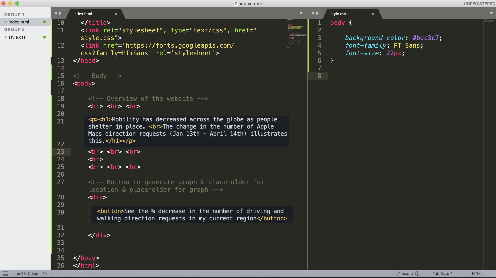
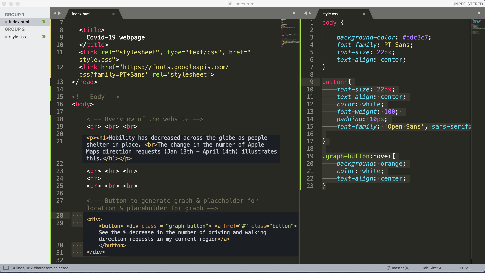

# Static Frontend Development - Part II 

#### CSS

*Session 2 Mini-Tutorial*

**This guide assumes that you have already installed/set-up the [Terminal](/session1/setup_terminal.md) or [Windows PowerShell](/session1/setup_windows_powershell.md) and [Sublime Text](/session1/setup_sublime.md). It also assumes you've completed the [HTML](/session2/tutorial_html_webserver.md) portion skeleton from the previous exercise**


**Step 0: Open your ```style.css``` file**

Open your  ```style.css``` folder by going into Sublime --> File --> Open. Go to your Frontend Folder and open your style.css file. Make sure your  ```index.html``` file is also open. Go to View --> Layout --> Column 2 to be able to see both files side by side. 

You should have two tabs that look like this: 


**Step 1: Link your CSS page to your HTML page**

Connect your CSS file with your ```index.html ``` page by using the following  ```href ``` tag  ```<link rel="stylesheet", type="text/css", href="style.css"> ``` in between your <head> </head> tags. If your html page is not in the same directory or subdirectory as your style.css file state the name of the directory within the href tag. (i.e.  ```href="Desktop/style.css" ``` ) 


**Step 2: Choose a background color for your website**

Go to [flatuicolors.com](flatuicolors.com) to choose a color that will be the background color for your webpage. Copy the hexcode of your chosen color by clicking and once copied, in your ```style.css ``` webpage start with the following code: 

````
body {
  background-color: [INSERT HEXCODE]; 
}

````


**Step 3: Choose a Font from Google Fonts for your website** 

Browse through the [Google Fonts Website](https://fonts.google.com/) and pick a font you'd like to use. Once you pick a font go to your ```index.html ``` page and add the following ```<link href='https://fonts.googleapis.com/css?family=[INSERT FONT NAME HERE]' rel='stylesheet'>``` Between the ```<head> </head>``` tags. If the font you choose has spaces in it's name join each part of the name with a "+" sign. 

Example:  ```<link href='https://fonts.googleapis.com/css?family=firstword+secondword' rel='stylesheet'>```

Go back to your ```style.css ``` page and 
````
body {
  background-color: [INSERT HEXCODE]; 
  font-family: [Insert Chosen Font Name];
  font-size: [Insert Number]px; 
  text-align: center;
}

````
Your screen should look something like this:

**Step 4: Recenter & Add a Hover Function to your button** 

Create a class around the button named "graph-button". This will allow us to create functionality special to that particular button. To do this edit between the ```<button> </button>``` tags in your ```index.html``` file so that it now looks like this: 

````
    <div> 
   		<button> <div class = "graph-button"> <a href="#" class="button">See the number of infections and deaths in my area</a> 
   		</button>
    </div>

````
Then navigate back to your ```style.css``` folder and add two more curly bracket blocks with the following code: 


````
button {
	font-size: 22px;
	text-align: center;
	color: white;
	font-weight: 100; 
	padding: 10px;
	font-family: 'Open Sans', sans-serif;

}

.graph-button:hover{
	background: orange;
	color: white;
	text-align: center;
}

````

The second chunk of code should cause your button to change color when your mouse hovers over your button. You'll also notice that we did not use hexcodes - this is because there are "css family colors" that don't require hexcodes -- they are a limited set of standard colors available by name. Change the background, colors and fonts as you wish! Experiment away :) 

Your screen should look something like this:

<br>

