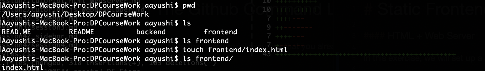
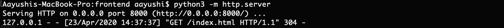

# Static Frontend Development - Part I 

#### HTML + Web Server

In this exercise, we will set up a simple HTML page and then run it on a local web server.

**Step 0: Ensure that index.html is set up in your frontend folder**

If you don't have an index.html file in your frontend folder, create one by following the steps below:



**Step 1: Running an http server locally**

Getting an HTTP server up and running locally is quite straightforward. We will use python to do so.



Tip: Use Ctrl + C to kill server process and get back to the command line prompt again.

**Step 2: Setting up your webpage**

Now, we move on to the HTML portion of things and set up our webpage. Open index.html in sublime. Try using right click to force index.html to open via sublime as opposed to your browser.

We then add following snippet of code:

````
<!doctype html>

<html>

<!-- Header -->
<head>

  <title>
    Covid-19 webpage
  </title>

</head>

<!-- Body -->
<body>

    <!-- Overview of the website -->
    <br> <br> <br>

    <p><h1 align="center">As of April 23rd, more than 2,616,000 people have been sickened by COVID-19 <br>and at least 181,000 people have died</h1></p>

    <br> <br> <br>
    <hr>
    <br> <br> <br>

    <!-- Button to generate graph & placeholder for location & placeholder for graph -->
    <div>
      
      <button>See the number of infections and deaths in my area</button>

    </div>
 
  
</body>
</html>

````

**Step 3: Save and exit the file and launch index.html again**

Ensure your server is up and running and refresh or relaunch index.html. You should now see content within the webpage.
