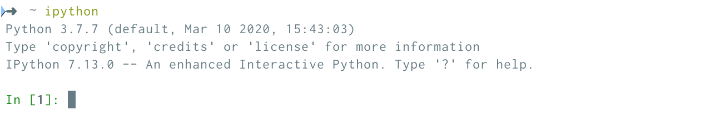

# Setting Up Your Python Command Shell (iPython)

*Session 3 Setup Guide*

*This guide assumes that you have already installed/set-up [Python 3](/session2/setup_python.md)*

Installing iPython (interactive Python) - an interactive Python Command Shell that makes Python coding ever so slightly easier - is as simple as entering the command ```pip3 install ipython``` *(Mac)* into your Terminal or ```pip install ipython``` *(Windows)* into your Windows Powershell.

Once the installation completes, type ```ipython --version``` into the Terminal. Hopefully, you will see ```7.13.0``` (*iPython 7.13.0 is the most recent version at the time of writing*).

To launch iPython simply type ```ipython``` (instead of ```python3```) into your Terminal. When launching iPython for the first time it's worthwhile double checking that it is using the correct version of Python, i.e., Python 3. Your Terminal output should look something like this (note the reference to ```Python 3.7.3``` in the first line):


